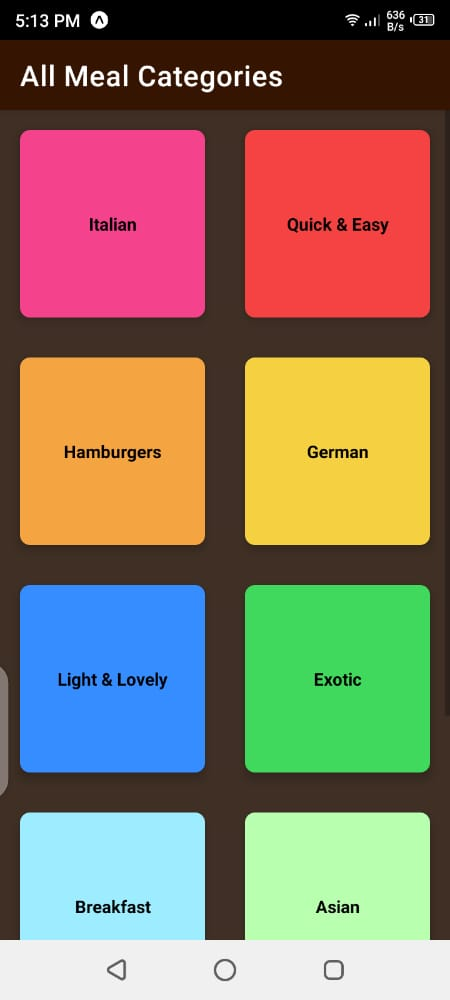
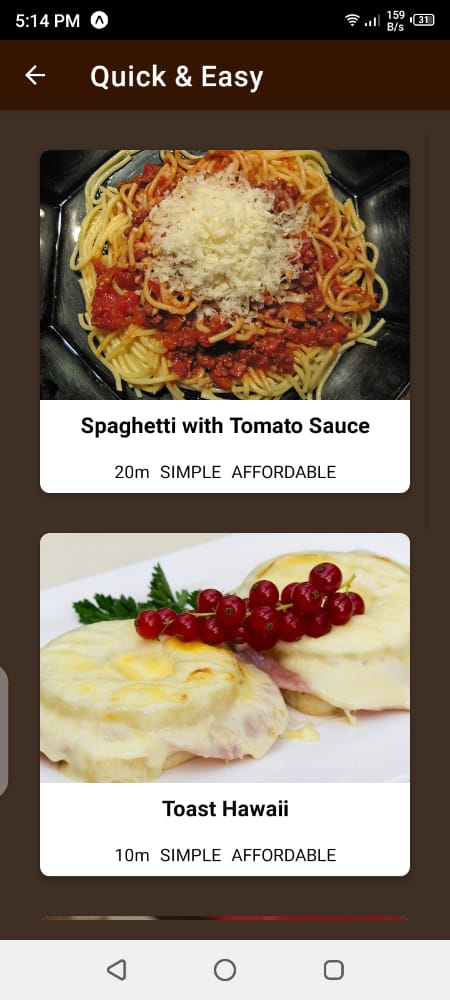
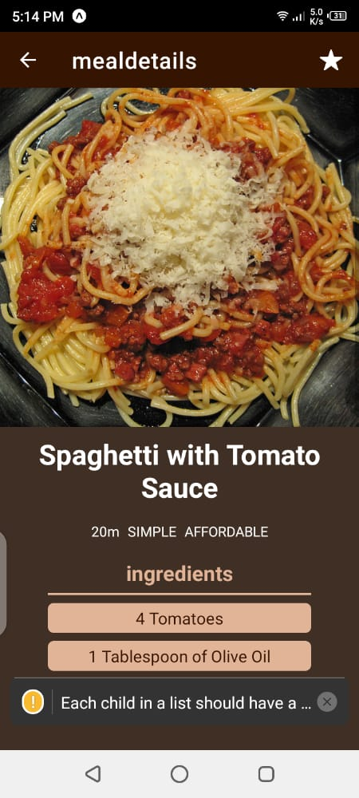
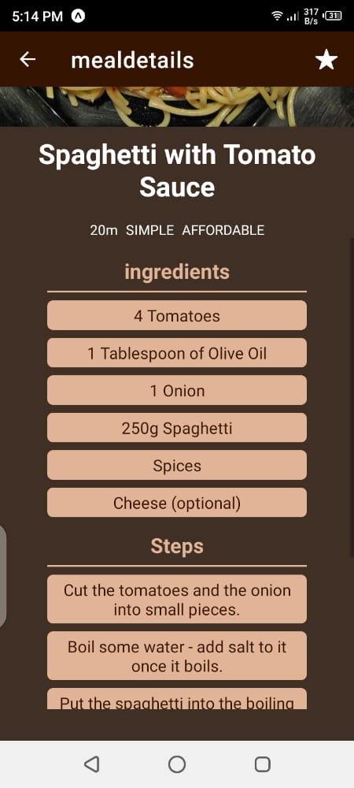

# MealsApp 
The Meals app is a  sample app that generally displays a set of classified meals to the user. The app gives more details on the meal and has the ingredients and steps it takes to cook it.
The aim of the project is to dwell more into 

* Use of the Navigator tool to switch between the screen stacks.
* Stylesheet styling of the app layout. 

## Getting Started
> _tip_: Follow installation procedure carefully.. 

### Prerequisite
1. The depends on the Node Package Manager (NPM). You will need to download and install Node from [https://nodejs.com/en/download](https://nodejs.org/en/download/). This will allow you to be able to run `npm` commands.
2. Install `expo` from `npm install -g expo-cli`
3. Install expo-go App on your phone. 

#### Getting started
1. Pull the repository to your local machine and install the dependencies by using `npm install .` in the same folder as the `package.json`
This will install all the dependencies required including the expo and expo-cli

2. `cd` into the folder on the terminal on your local machine and run command `npm start`
This will start  the metro-bundler on your terminal and a QR code on the logs. 

3. In your phone launch the expo-go app and scan the QR code. On iPhone, use the camera utility for scanning.
This will start the app on your phone and you are ready to play. 

### screenshots

